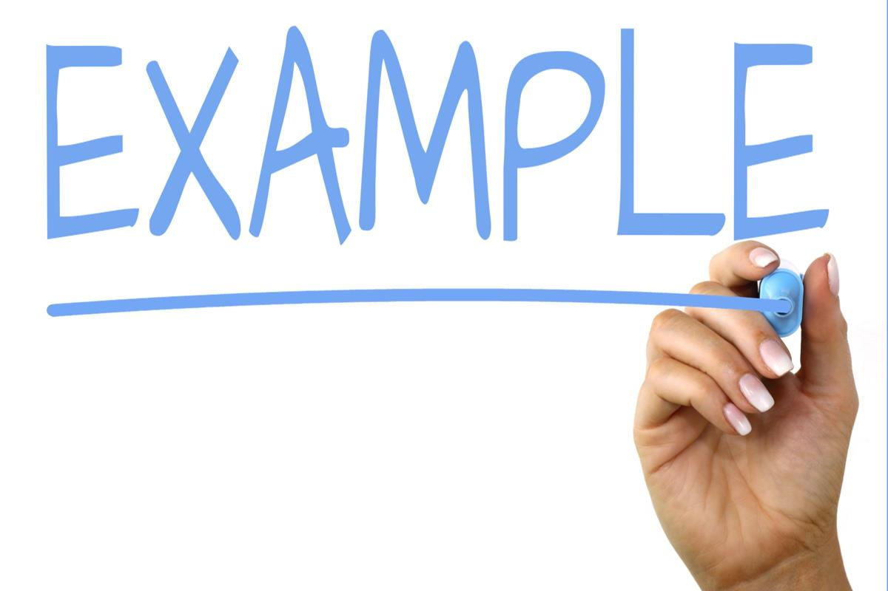

# モダンなWeb開発の基礎
<p class="author">
  著者（SNS）
</p>

## 第1章 はじめに

今日のWeb開発は、かつてないほど多様なツールと技術に満ちています。本書は、その中でも特に重要となる**フロントエンド技術**の基礎を、実践的なコードを交えながら解説します。



上記の図形は、画像の例です。

## 2.1 CSSの基本原則

CSS（Cascading Style Sheets）は、Webページの見た目を整えるための言語です。
その最も重要な役割は、HTMLの構造とプレゼンテーションを分離することにあります。これにより、コンテンツの変更を最小限に抑えつつ、デザインを柔軟に変更できます。


### 2.1.1 セレクタとプロパティ

CSSは、セレクタとプロパティの組み合わせで記述します。
セレクタはスタイルの適用対象を指定し、プロパティは適用するスタイルを定義します。


### 2.1.2 ボックスモデル

Web上のすべての要素は、ボックスとして描画されます。この「ボックスモデル」を理解することは、レイアウトを正しく組む上で不可欠です。ボックスは、以下の4つの領域から構成されます。

1.  コンテンツ領域
2.  パディング
3.  ボーダー
4.  マージン
- a
  - b
    - c
- d

## 3.1 JavaScriptとDOM操作

JavaScriptは、Webページに動的な動きを与えるためのプログラミング言語です。DOM（Document Object Model）を操作することで、ページの要素を動的に変更できます。

> DOMは、HTMLドキュメントをノードのツリー構造として表現します。このツリー構造を操作することで、JavaScriptは要素の追加、削除、属性の変更などを行えます。
>
> — MDN Web Docs


### 3.1.1 `querySelector`の使用

要素を選択する最も一般的な方法の一つが`querySelector`です。

```javascript
// IDが`myElement`の要素を取得
const element = document.querySelector('#myElement');

// クラスが`card`の最初の要素を取得
const card = document.querySelector('.card');
```

## 4.1 比較表

プロパティ名 | 役割 | 単位
--- | --- | ---
**margin** | 要素の外側の余白 | px, %, emなど
**padding** | 要素の内側の余白 | px, %, emなど
**border** | 要素の境界線 | px, solid, dashedなど